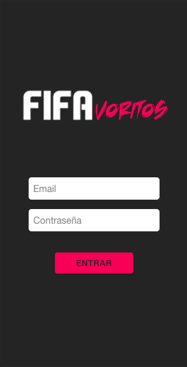
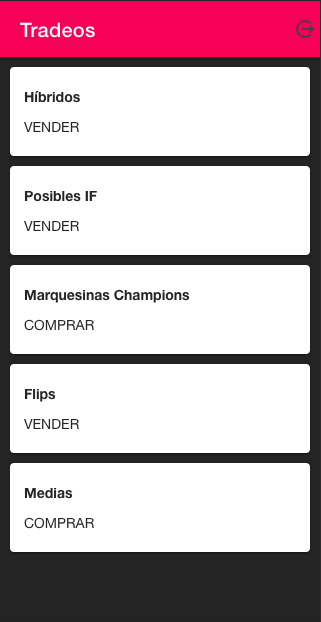
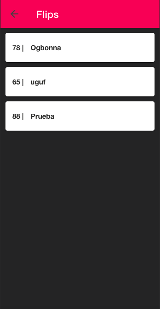
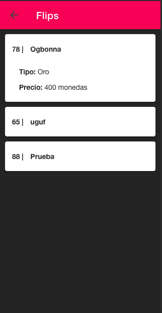

# Fifavoritos
La aplicación Fifavoritos te permite tradear más fácilmente en FIFA. La idea es que un administrador, experto en tradeo, pueda ponerte tradeos y jugadores los cuales solo tienes que preocuparte de comprar o vender según diga el administrador.

### Funcionalidad y pantallas de la app

En esta pantalla pueden hacer login los distintos usuarios

En cuanto iniciamos sesión tenemos la lista de tradeos disonibles en este momento y si pulsamos nos lleva a los jugadores de cada tradeo

Aquí se pueden ver que jugadores hay en el tradeo anteriormente seleccionado

Por último pulsando en un jugador podemos ver detalles de él como el precio de compra o venta

### Vídeo explicativo
Haz click [aquí](https://youtu.be/ms5C96Ro5bo) para ver un vídeo explicativo
